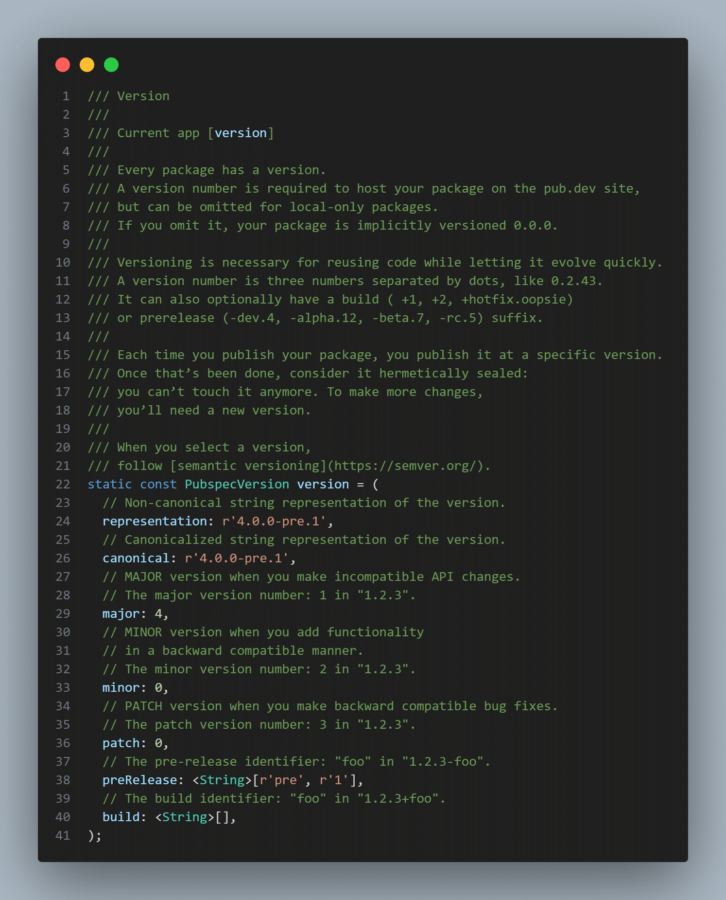

# pubspec_generator

##### Code generator pubspec.yaml.g.dart from pubspec.yaml

[](https://pub.dev/packages/pubspec_generator)
[](https://github.com/PlugFox/pubspec_generator/actions/workflows/checkout.yml)
[](https://codecov.io/gh/PlugFox/pubspec_generator)
[](https://github.com/plugfox/pubspec_generator)
[](https://opensource.org/licenses/MIT)
[](https://pub.dev/packages/linter)
[](https://github.com/plugfox/pubspec_generator/)

<!--
[](https://codecov.io/gh/PlugFox/pubspec_generator)
-->

## Setup

Add the following lines to the pubspec.yaml:

```yaml
dev_dependencies:
  build_runner: ^1.12.2
  pubspec_generator: ^3.0.0
```

and then execute in the console:

```bash
dart run build_runner build
```

## Path of creation

Create `build.yaml` at project root (near with `pubspec.yaml`).
And set output path:

```yaml
# Read about `build.yaml` at https://pub.dev/packages/build_config
targets:
  $default:
    sources:
      - $package$
      - lib/**
      - pubspec.yaml
    builders:
      pubspec_generator:
        options:
          output: lib/src/constants/pubspec.yaml.g.dart
```

## Result example


Generated record for version.

By default, at project path `lib/src/constants/pubspec.yaml.g.dart`:

```dart
sealed class Pubspec {
  static const PubspecVersion version = (
    representation: r'4.0.0-pre.1',
    canonical: r'4.0.0-pre.1',
    major: 4,
    minor: 0,
    patch: 0,
    preRelease: <String>[r'pre', r'1'],
    build: <String>[],
  );

  static const String name = r'pubspec_generator';

  static const String description =
      r'Code generator pubspec.yaml.g.dart from pubspec.yaml. Just import `pubspec_generator` and then run `dart run build_runner build`';

  static const String homepage =
      r'https://github.com/PlugFox/pubspec_generator';

  static const String repository =
      r'https://github.com/PlugFox/pubspec_generator/tree/master';

  static const String issueTracker =
      r'https://github.com/PlugFox/pubspec_generator/issues';

  static const String documentation = r'';

  static const String publishTo = r'https://pub.dev/';

  static const List<Object> funding = <Object>[
    r'https://www.buymeacoffee.com/plugfox',
    r'https://www.patreon.com/plugfox',
    r'https://boosty.to/plugfox',
  ];

  static const List<Object> falseSecrets = <Object>[];

  static const List<Object> screenshots = <Object>[
    <String, Object>{
      'description': r'Icon',
      'path': r'.img/icon.png',
    },
  ];

  static const List<Object> topics = <Object>[
    r'yaml',
    r'pubspec',
    r'generator',
    r'build',
    r'build_runner',
    r'codegeneration',
  ];

  static const Map<String, String> environment = <String, String>{
    'sdk': '>=3.0.0 <4.0.0',
  };

  static const Map<String, Object> platforms = <String, Object>{
    'android': r'',
    'ios': r'',
    'linux': r'',
    'macos': r'',
    'web': r'',
    'windows': r'',
  };

  static const Map<String, Object> dependencies = <String, Object>{
    'analyzer': r'^6.0.0',
    'build': r'^2.3.1',
    'pub_semver': r'^2.1.4',
    'yaml': r'^3.1.2',
  };

  static const Map<String, Object> devDependencies = <String, Object>{
    'build_runner': r'^2.3.3',
    'build_runner_core': r'^7.2.10',
    'build_test': r'^2.1.5',
    'test': r'^1.21.0',
  };

  static const Map<String, Object> dependencyOverrides = <String, Object>{};

  static const Map<String, Object> executables = <String, Object>{};

  static const Map<String, Object> source = <String, Object>{
    'name': name,
    'description': description,
    'repository': repository,
    'issue_tracker': issueTracker,
    'homepage': homepage,
    'documentation': documentation,
    'publish_to': publishTo,
    'version': version,
    'funding': funding,
    'false_secrets': falseSecrets,
    'screenshots': screenshots,
    'topics': topics,
    'platforms': platforms,
    'environment': environment,
    'dependencies': dependencies,
    'dev_dependencies': devDependencies,
    'dependency_overrides': dependencyOverrides,
  };
}
```

- Example provided without comments.

## Changelog

Refer to the [Changelog](https://github.com/plugfox/pubspec_generator/blob/master/CHANGELOG.md) to get all release notes.

## Maintainers

[Plague Fox](https://plugfox.dev)

## Funding

If you want to support the development of our library, there are several ways you can do it:

- [Buy me a coffee](https://www.buymeacoffee.com/plugfox)
- [Support on Patreon](https://www.patreon.com/plugfox)
- [Subscribe through Boosty](https://boosty.to/plugfox)

We appreciate any form of support, whether it's a financial donation or just a star on GitHub. It helps us to continue developing and improving our library. Thank you for your support!

## License

[MIT](https://github.com/plugfox/pubspec_generator/blob/master/LICENSE)
